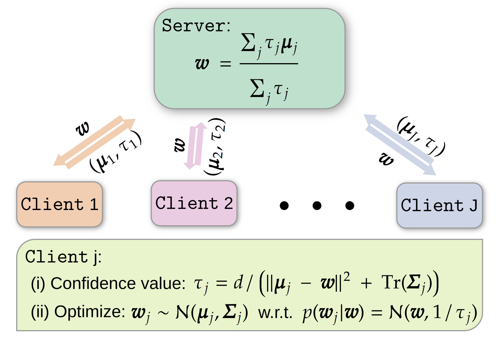

## Confidence-aware Personalized Federated Learning via Variational Expectation Maximization [CVPR 2023]


### Abstract
Federated Learning (FL) is a distributed learning scheme to train a shared model across clients. One common and fundamental challenge in FL is that the sets of data across clients could be non-identically distributed and have different sizes. Personalized Federated Learning (PFL) attempts to solve this challenge via locally adapted models. In this work, we present a novel framework for PFL based on hierarchical Bayesian modeling and variational inference. A global model is introduced as a latent variable to augment the joint distribution of clients' parameters and capture the common trends of different clients, optimization is derived based on the principle of maximizing the marginal likelihood and conducted using variational expectation maximization. Our algorithm gives rise to a closed-form estimation of a confidence value which comprises the uncertainty of clients' parameters and local model deviations from the global model. The confidence value is used to weigh clients' parameters in the aggregation stage and adjust the regularization effect of the global model. We evaluate our method through extensive empirical studies on multiple datasets. Experimental results show that our approach obtains competitive results under mild heterogeneous circumstances while significantly outperforming state-of-the-art PFL frameworks in highly heterogeneous settings.

<p align="center">
      
</p>
<p align="center">
    <em>An overview of our confidence-aware personalized federated learning framework.</em>
</p>

### Data Heterogeneity
In this repository, we present the implementation of two scenarios, label distribution skew and label concept drift, using the CIFAR-10 and CIFAR-100 datasets respectively. Additionally, we consider data quantity disparity for both scenarios, where the training set is randomly partitioned into J pieces and then distributed to J clients. Furthermore, this repository supports data scarcity, allowing users to simulate situations where only limited amount of data is available.

### Download
Make sure that conda is installed.
```sh
git clone git@github.com:JunyiZhu-AI/confidence_aware_PFL.git
cd confidence_aware_PFL
conda create -n vem python==3.8
conda activate vem
conda install pip
pip install -r requirement.txt
```

### Run
To run the experiments, follow these instructions:

1. For label distribution skew on CIFAR-10:
```sh
python3 -m experiment.run_experiment --config experiment/configs/cifar10.json
```

2. For label distribution skew on CIFAR-10 with 5,000 data points:
```sh
python3 -m experiment.run_experiment --config experiment/configs/cifar10_data5000.json
```

3. For label concept drift on CIFAR-100:
```sh
python3 -m experiment.run_experiment --config experiment/configs/cifar100.json
```

4. Example of running an experiment by passing arguments directly (the following hyperparameters are not tuned and are for demonstration purposes only):
```sh
python3 -m experiment.run_experiment \
      --model CNNCifar \
      --dataset CIFAR10 \
      --batch_size 10 \
      --lr_head 0.001 \
      --lr_base 0.001 \
      --momentum 0.9 \
      --n_labels 5 \
      --head_epochs 10 \
      --base_epochs 5 \
      --n_rounds 100 \
      --max_data 20000 \
      --n_clients 50 \
      --sampling_rate 0.1 \
      --seed 42 \
      --n_mc 1 \
      --beta 0.9 \
      --scale 1
```

### Modify
The explanation of hyperparameters can be found in the ```experiment\run_experiment.py``` file. Our method employs a head-base architecture, making it easily adaptable to other types of networks. If you wish to modify the network, we recommend fine-tuning the hyperparameters. In our experience, it is efficient to use the hyperparameters of Federated Averaging (FedAvg) for the base network, while only tuning the head network specifically. However, full grid search can often obtain better performance.

### Citation
```
@inproceedings{Zhu2023a,
  TITLE = {Confidence-aware Personalized Federated Learning via Variational Expectation Maximization},
  AUTHOR = {Zhu, Junyi and Ma, Xingchen and Blaschko, Matthew B.},
  BOOKTITLE = {IEEE/CVF Conference on Computer Vision and Pattern Recognition},
  YEAR = {2023},
}
```
